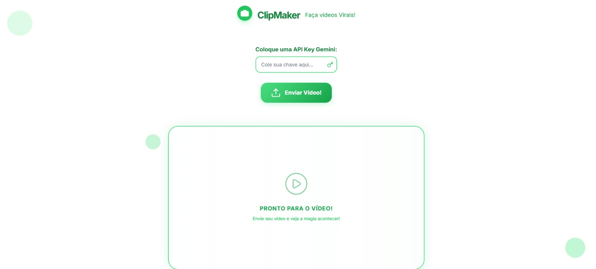

<h1 align="center"> Projeto ClipMaker </h1>

NLW OPERATOR - Trilha Iniciante

  <a href="#-tecnologias">Tecnologias</a>&nbsp;&nbsp;&nbsp;|&nbsp;&nbsp;&nbsp;
  <a href="#-projeto">Projeto</a>&nbsp;&nbsp;&nbsp;|&nbsp;&nbsp;&nbsp;
  <a href="#Layout">Layout</a>
  <a href="#memo-licença">Licença</a>

  

 

  

## 🚀 Tecnologias

Esse projeto foi desenvolvido com as seguintes tecnologias:

- HTML e CSS
- JavaScript
- IA
- Git e Github

## 💻 Projeto

O projeto é apenas um teste inicial de aprendizado

## Layout

---

Feito com ♥ by André Vitor :wave: 